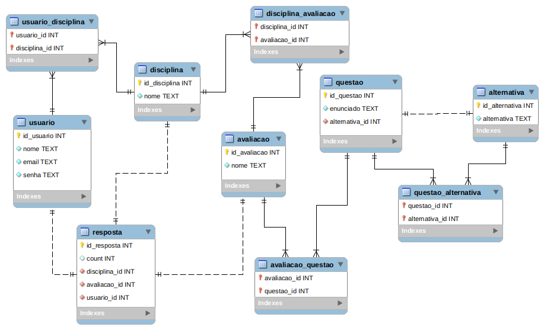

### Banco de Dados - BCD29008

## Projeto Prático 02 - Sistema web para avaliação

Neste projeto foi utilizado o banco de dados SQLite.

* **Modelagem do banco de dados:** 

OBS.: Caso necessário alterar a linha 22 e 25 [neste link](app.py).